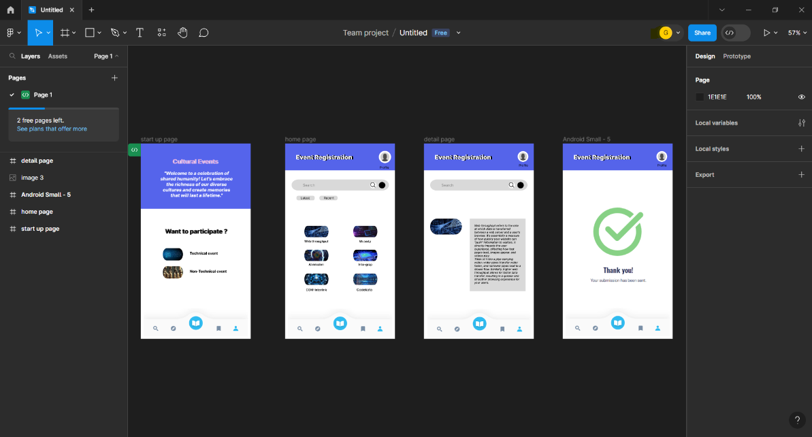

# Ex09 Event Registration Web Application
## Date:

## AIM:
To design, develop and deploy a web application for event registration.

## DESIGN STEPS:

### Step 1:
Create a new frame.

### Step 2:
Select any one preset size of your choice.

### Step 3:
Select the shapes you need.

### Step 4:
Import images as needed.

### Step 5:
Create pages based on your need and link them.

### Step 6:

Validate the HTML and CSS code.

### Step 6:

Publish the website in the given URL.

## DESIGN TOOL:
Figma

## CODE:
~~~
Start up page:

    

    
Cultural Events

    
Cultural Events

    
"Welcome to a celebration of shared humanity! Let's embrace the richness of our diverse cultures and create memories that will last a lifetime."

    
Want to participate ?

    
Want to participate ?

    
    
    
Technical event

    
Non-Technical event

    

// Cultural Events
color: #E6E6FA;
 font-size: 20px;
 font-family: Inter;
 font-weight: 700;
 word-wrap: break-word
---
// Cultural Events
color: #DDA0DD;
 font-size: 20px;
 font-family: Inter;
 font-weight: 700;
 word-wrap: break-word
---
// "Welcome to a celebration of shared humanity! Let's embrace the richness of our diverse cultures and create memories that will last a lifetime."
color: white;
 font-size: 15px;
 font-family: Inter;
 font-style: italic;
 font-weight: 800;
 word-wrap: break-word
---
// Want to participate ?
color: black;
 font-size: 20px;
 font-family: Inter;
 font-weight: 700;
 word-wrap: break-word
---
// Want to participate ?
color: rgba(0, 0, 0, 0.64);
 font-size: 20px;
 font-family: Inter;
 font-weight: 700;
 word-wrap: break-word
---
// Technical event
color: black;
 font-size: 12px;
 font-family: Inter;
 font-weight: 700;
 word-wrap: break-word
---
// Non-Technical event
color: black;
 font-size: 12px;
 font-family: Inter;
 font-weight: 700;
 word-wrap: break-word
 ~~~
 ~~~
 home page:

    

    
    

    

    

    

    
    

    
Profile

    

    
Latest

    

    
Recent

    
    
Search 

    
    
    
    
    
    
    
Codekata

    
COM-Interlink

    
Ai mission

    
Inte-grap

    
Web throughput

    
Mr.cody

// Profile
color: black;
 font-size: 10px;
 font-family: Inter;
 font-weight: 400;
 word-wrap: break-word
---
// Latest
color: black;
 font-size: 10px;
 font-family: Inter;
 font-weight: 400;
 word-wrap: break-word
---
// Recent
color: black;
 font-size: 10px;
 font-family: Inter;
 font-weight: 400;
 word-wrap: break-word
---
// Search 
color: rgba(0, 0, 0, 0.40);
 font-size: 12px;
 font-family: Inter;
 font-weight: 400;
 word-wrap: break-word
---
// Codekata
color: black;
 font-size: 11px;
 font-family: Inter;
 font-weight: 600;
 word-wrap: break-word
---
// COM-Interlink
color: black;
 font-size: 10px;
 font-family: Inter;
 font-weight: 600;
 word-wrap: break-word
---
// Ai mission
color: black;
 font-size: 10px;
 font-family: Inter;
 font-weight: 600;
 word-wrap: break-word
---
// Inte-grap
color: black;
 font-size: 10px;
 font-family: Inter;
 font-weight: 600;
 word-wrap: break-word
---
// Web throughput
color: black;
 font-size: 10px;
 font-family: Inter;
 font-weight: 600;
 word-wrap: break-word
---
// Mr.cody
color: black;
 font-size: 10px;
 font-family: Inter;
 font-weight: 600;
 word-wrap: break-word
 ~~~
 ~~~
 detail page:

    

    

    
    
Profile

    
    

    

    

    

    

    
    
Search 

    
Web throughput refers to the rate at which data is transferred between a web server and a user's browser. It's essentially a measure of how quickly your website can "push" information to visitors. It directly impacts the user experience, affecting how fast pages load, images appear, and videos play. Think of it like a pipe carrying water: wider pipes transfer water faster, and narrower pipes lead to a slower flow. Similarly, higher web throughput allows for faster data transfer, resulting in a quicker and smoother browsing experience for your users.

    

// Profile
color: black;
 font-size: 10px;
 font-family: Inter;
 font-weight: 400;
 word-wrap: break-word
---
// Search 
color: rgba(0, 0, 0, 0.40);
 font-size: 12px;
 font-family: Inter;
 font-weight: 400;
 word-wrap: break-word
---
// Web throughput refers to the rate at which data is transferred between a web server and a user's browser. It's essentially a measure of how quickly your website can "push" information to visitors. It directly impacts the user experience, affecting how fast pages load, images appear, and videos play. Think of it like a pipe carrying water: wider pipes transfer water faster, and narrower pipes lead to a slower flow. Similarly, higher web throughput allows for faster data transfer, resulting in a quicker and smoother browsing experience for your users.
color: black;
 font-size: 9px;
 font-family: Inter;
 font-style: italic;
 font-weight: 500;
 word-wrap: break-word
 ~~~
 ~~~
 thank you page:

    
    

    
Profile

    

    

// Profile
color: black;
 font-size: 10px;
 font-family: Inter;
 font-weight: 400;
 word-wrap: break-word
 ~~~
## OUTPUT:

## RESULT:
The program to design, develop and deploy a web application for event registration is completed successfully.
